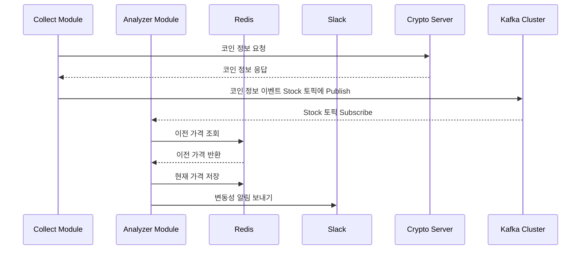

# Stock Volatility Alert

이 프로젝트는 가상화폐 변동성 알림 시스템으로, 크게 2가지 모듈로 구성되어 있습니다. 
`Collector Module`은 가상화폐 거래소 API를 사용해 원화(KRW)로 거래 가능한 코인을 수집하며, 단기(5분)와 장기(60분) 주기로 데이터를 지속적으로 수집하여 Kafka 토픽에 발행합니다. `Analyzer Module`은 해당 Kafka 토픽을 구독하여 각 코인 정보를 얻어옵니다. 수집 주기별로 지정된 가격 변동률을 감지하면 Slack을 통해 알림을 전송합니다.

프로젝트의 주요 목적은 가상화폐 거래소에서 제공하지 않는 가격 변동성 알림 기능을 구현하는 것입니다. 거래소에서는 특정 가격 도달 시 알림만 제공하므로, 이를 보완하기 위해 시스템을 구축했습니다.

#### 사용기술

- Java, SpringBoot, Redis, Kafka

 

## 프로젝트 상세

### 1. Kafka Cluster (KRaft Mode)

Kafka Cluster의 메타데이터는 과거에 ZooKeeper라는 외부 서비스를 통해 관리되었습니다. 그러나 Apache Kafka® 3.5 버전부터 Zookeeper 사용이 Deprecated 되고, Kafka 자체 토픽을 활용한 메타데이터 관리, 즉 KRaft Mode로의 전환을 권장하고 있습니다.

### 2. 프로세스 Flow

### 3. 실행 결과

 
**좌측 이미지 :** 짧은 타임프레임으로 설정하여 코인 정보 수집 
**우측 이미지 :** 긴 타임프레임으로 설정하여 코인 정보 수집

 
**좌측 이미지 :** 짧은 타임프레임을 주기로 수집하는 코인 정보 알림 메시지 
**우측 이미지 :** 긴 타임프레임을 주기로 수집하는 코인 정보 알림 메시지

**위 테스트 결과는 `짧은 타임프레임(단기 / 5분 / 0.5% 변동률)`과 `긴 타임프레임(장기 / 10분 / 0.5% 변동률)`로 설정하여 테스트한 결과입니다.**

 

## 활용 Tip

**[ 추천하는 설정값 ]**

#### 단기 (짧은 타임프레임)

- 수집 간격 : 5분
- 변동 감지 : 0.7%

#### 장기 (긴 타임프레임)

- 수집 간격 : 1시간
- 변동 감지 : 1%

 

---
---

**가상화폐 거래 관련 인사이트를 공유하는 TradingView 프로필 :  [Topy](https://kr.tradingview.com/u/Topy_/)**