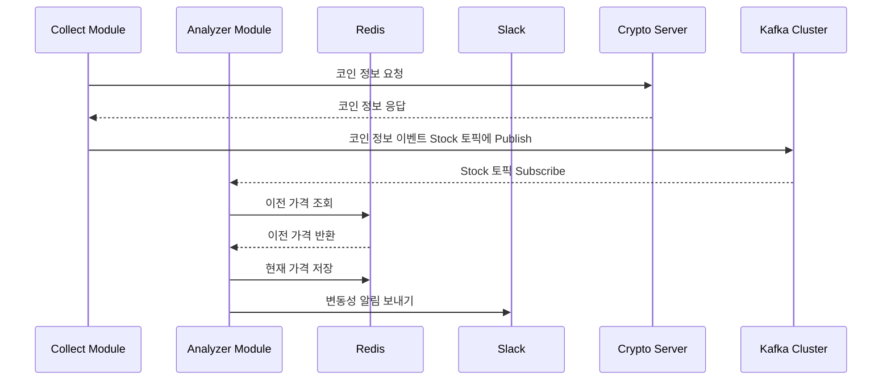

# Stock Volatility Alert

이 프로젝트는 가상화폐 변동성 알림 시스템으로, 크게 Collector Module과 Analyzer Module로 구성되어 있습니다.
Collector Module은 가상화폐 거래소 API를 활용하여 사용자가 원하는 코인의 가격을 원하는 시간 간격으로 조회하고, 이를 Kafka Cluster의 Stock 토픽으로 발행합니다.
이후 Analyzer Module에서는 해당 토픽을 구독하여 발행된 코인 정보 이벤트를 가져와 특정 퍼센트 이상의 가격 변동성이 감지되면 Slack을 통해 알림을 전송합니다.

이 프로젝트의 주요 목적은 가상화폐 거래소에서 지원하지 않는 기능을 구현하는 것입니다.
가상화폐 거래소에서는 특정 가격에 도달했을 때의 알림 기능을 제공하지만, 가격 변동성에 대한 알림 기능은 제공하지 않기 때문에 이를 보완하기 위한 목적으로 해당 시스템을 구축하였습니다.

#### 사용기술

- Java, SpringBoot, Redis, Kafka


<br>

## 프로젝트 상세

### 1. Kafka Cluster (KRaft Mode)

Kafka Cluster의 메타데이터는 과거에 ZooKeeper라는 외부 서비스를 통해 관리되었습니다. 그러나 Apache Kafka® 3.5 버전부터 Zookeeper 사용이 Deprecated 되고, Kafka 자체 토픽을 활용한 메타데이터 관리, 즉 KRaft Mode로의 전환을 권장하고 있습니다.


### 2. 프로세스 Flow



### 3. 종목 추가 및 제거

Enum 클래스를 활용하여 데이터를 수집할 종목을 추가하고 삭제합니다.

```java

@Getter
public enum Stock {
    KRW_BTC("KRW-BTC"),
    KRW_ETH("KRW-ETH"),
    KRW_XRP("KRW-XRP"),
    KRW_DOGE("KRW-DOGE");

    private final String ticker;

    Stock(String ticker) {
        this.ticker = ticker;
    }
}
```

**아래 이미지는 위 Enum 클래스에서 정의한 4개의 코인 정보를 수집하고, 변동성 알림 기능에 대한 테스트 결과입니다.**

<br>[ Slack에 쌓이는 변동성 알림 메시지 ]
<br><br>
<br>[ Kafka 'Stock' 토픽 파티션에 쌓이는 코인 데이터 ]

<br>

## 활용 Tip

**[ 추천하는 설정값 ]**

#### 첫 번째

- 수집 간격 : 1분
- 변동 감지 : 0.2%

#### 두 번째

- 수집 간격 : 1시간
- 변동 감지 : 1%

<br>

---
---

TradingView : [Topy](https://kr.tradingview.com/u/Topy_/)