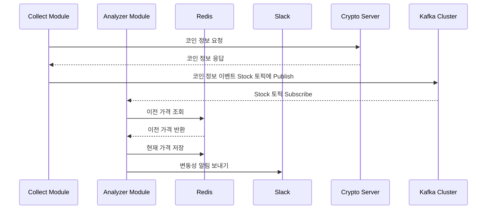

# Stock Volatility Alert

이 프로젝트는 가상화폐 변동성 알림 시스템으로, 크게 Collector Module과 Analyzer Module로 구성되어 있습니다. 
`Collector Module`은 가상화폐 거래소 API를 활용하여 거래소에 존재하는 모든 코인들 중 원화(KRW)로 거래 가능한 코인만 수집합니다. 수집 주기는 단기(예: 5분)와 장기(예: 10분)로 나뉘며, 두 가지 주기로 각각 데이터를 지속적으로 수집합니다. 이렇게 수집된 모든 데이터는 Kafka Cluster의 특정 토픽으로 발행됩니다.
`Analyzer Module`은 해당 Kafka 토픽을 구독하여 각 코인 정보를 얻어옵니다. 각 수집 주기(단기, 장기)마다 지정된 가격 변동률이 감지되면, Slack을 통해 알림을 전송합니다.

이 프로젝트의 주요 목적은 가상화폐 거래소에서 지원하지 않는 기능을 구현하는 것입니다.
가상화폐 거래소에서는 특정 가격에 도달했을 때의 알림 기능을 제공하지만, 가격 변동성에 대한 알림 기능은 제공하지 않기 때문에 이를 보완하기 위한 목적으로 해당 시스템을 구축하였습니다.

#### 사용기술

- Java, SpringBoot, Redis, Kafka

 

## 프로젝트 상세

### 1. Kafka Cluster (KRaft Mode)

Kafka Cluster의 메타데이터는 과거에 ZooKeeper라는 외부 서비스를 통해 관리되었습니다. 그러나 Apache Kafka® 3.5 버전부터 Zookeeper 사용이 Deprecated 되고, Kafka 자체 토픽을 활용한 메타데이터 관리, 즉 KRaft Mode로의 전환을 권장하고 있습니다.

### 2. 프로세스 Flow

### 3. 실행 결과

 **좌측 이미지 :** 짧은 타임프레임으로 설정하여 코인 정보 수집 **우측 이미지 :** 긴 타임프레임으로 설정하여 코인 정보 수집

 

 **좌측 이미지 :** 짧은 타임프레임을 주기로 수집하는 코인 정보 알림 메시지 **우측 이미지 :** 긴 타임프레임을 주기로 수집하는 코인 정보 알림 메시지

**위 테스트 결과는 `짧은 타임프레임(단기 / 5분 / 0.5% 변동률)`과 `긴 타임프레임(장기 / 10분 / 0.5% 변동률)`로 설정하여 테스트한 결과입니다.**

 

## 활용 Tip

**[ 추천하는 설정값 ]**

#### 단기 (짧은 타임프레임)

- 수집 간격 : 5분
- 변동 감지 : 0.7%

#### 장기 (긴 타임프레임)

- 수집 간격 : 1시간
- 변동 감지 : 1%

 

---
---

TradingView : [Topy](https://kr.tradingview.com/u/Topy_/)